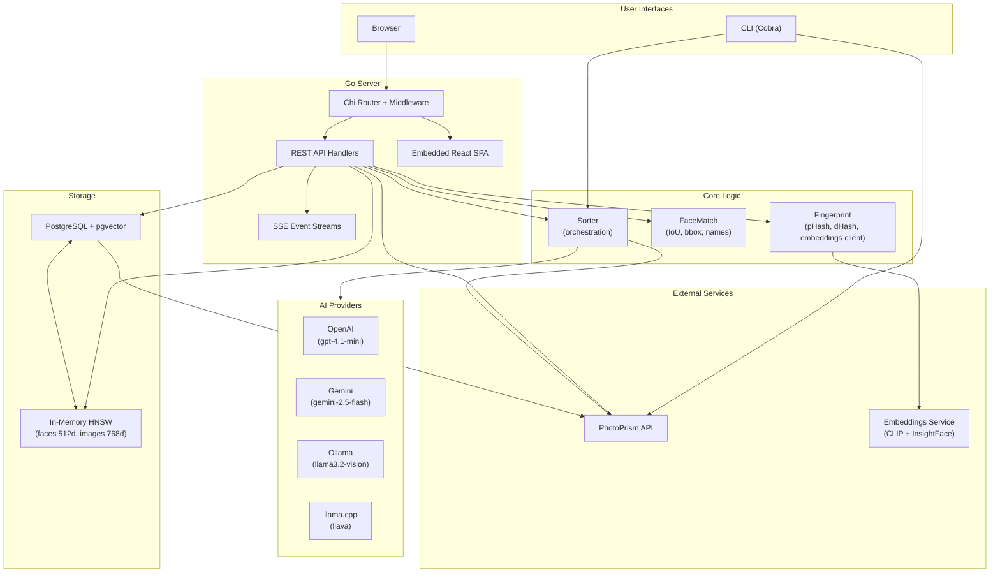

# Architecture

## Overview

Photo Sorter is a CLI tool and web application that organizes photos stored in [PhotoPrism](https://photoprism.app/) using AI-powered analysis, image/face embeddings, and similarity search. It analyzes photos to generate labels, descriptions, and date estimates, provides face recognition and matching across a library, enables text-to-image and image-to-image similarity search via CLIP embeddings, and includes a photo book layout editor. The backend is written in Go (Cobra CLI, Chi HTTP router, pgvector for vector storage) and the frontend is a React + TypeScript + TailwindCSS single-page application embedded into the Go binary at compile time.

## System Diagram



## Package Structure

| Package | Purpose | Key Types |
|---------|---------|-----------|
| `cmd/` | Cobra CLI commands (sort, albums, labels, upload, move, photo, cache, serve, etc.) | Root command, subcommands |
| `internal/ai/` | AI provider interface and implementations (OpenAI, Gemini, Ollama, llama.cpp) | `Provider`, `PhotoAnalysis`, `BatchPhotoRequest`, `Usage` |
| `internal/ai/prompts/` | Embedded prompt templates (photo analysis, date estimation, CLIP translation) | Embedded text files |
| `internal/config/` | Environment-based configuration loader and pricing data | `Config`, `prices.yaml` (embedded) |
| `internal/constants/` | Shared constants for page sizes, thresholds, concurrency limits, upload limits | Constants |
| `internal/database/` | Repository interfaces, HNSW index wrappers, cosine distance | `FaceReader`, `FaceWriter`, `EmbeddingReader`, `BookReader`, `BookWriter`, `HNSWIndex` |
| `internal/database/postgres/` | PostgreSQL backend with pgvector, migrations, session persistence | `EmbeddingRepository`, `FaceRepository`, `BookRepository`, `SessionStore` |
| `internal/facematch/` | Face matching utilities: IoU computation, bounding box conversion, name normalization | `NormalizePersonName`, IoU functions |
| `internal/fingerprint/` | Perceptual hash computation (pHash, dHash) and embeddings HTTP client | `Fingerprint`, embedding client |
| `internal/photoprism/` | PhotoPrism REST API client, split by domain (albums, photos, labels, markers, subjects, faces, upload) | `PhotoPrism`, `Album`, `Photo`, `Label`, `Marker`, `Subject` |
| `internal/sorter/` | Orchestrates photo fetching, AI analysis, and label application | `Sorter` |
| `internal/web/` | Web server setup and route registration | `Server` |
| `internal/web/middleware/` | HTTP middleware: auth, CORS, session management, PhotoPrism client injection | `SessionManager`, `RequireAuth`, `WithPhotoPrismClient` |
| `internal/web/handlers/` | REST API handlers for all endpoints (albums, photos, faces, books, sort jobs, SSE) | `FacesHandler`, `BooksHandler`, handler functions |
| `web/` | React + TypeScript + TailwindCSS frontend (Vite build, i18n with Czech + English) | Pages, components, hooks, typed API client |

## Data Flow

### 1. Photo Sorting (CLI or Web)

```
User triggers sort (CLI command or POST /api/v1/sort)
    |
    v
Sorter receives album UID + options (provider, concurrency, dry-run, etc.)
    |
    v
Sorter fetches photo list from PhotoPrism API (GET /api/v1/photos)
    |
    v
For each photo (parallel, up to N concurrency):
    +-- Download image bytes from PhotoPrism
    +-- Send image + metadata to AI Provider (AnalyzePhoto)
    +-- AI returns labels, description, optional date estimate
    |
    v
(Optional) EstimateAlbumDate: send all descriptions to AI for album-wide date
    |
    v
Apply results to PhotoPrism (unless dry-run):
    +-- Replace labels (confidence > 80%)
    +-- Set description/caption
    +-- Set date if missing (or if --force-date)
    +-- Update notes with "Analyzed by: <model>"
```

Three processing modes are supported: **standard** (N parallel photo calls + 1 album date call), **individual-dates** (date estimated per photo in each call), and **batch** (OpenAI batch API: submit, poll, download -- 50% cheaper but asynchronous).

### 2. Face Matching

```
Embeddings Service computes InsightFace embeddings (512-dim) for each face
    |
    v
Embeddings stored in PostgreSQL faces table + loaded into in-memory HNSW index
    |
    v
On match request (POST /api/v1/faces/match):
    +-- Query HNSW index for nearest neighbors (O(log N), ~1ms)
    +-- Fetch candidate face records from PostgreSQL
    +-- Match InsightFace bboxes to PhotoPrism markers via IoU (threshold >= 0.1)
    +-- Return ranked suggestions with actions (create_marker, assign_person)
    |
    v
On apply (POST /api/v1/faces/apply):
    +-- Create or update PhotoPrism marker with assigned subject
```

### 3. Web Request Flow

```
Browser sends request
    |
    v
Chi Router
    +-- Security headers middleware (CSP, X-Frame-Options, etc.)
    +-- CORS middleware
    +-- Static file serving (embedded React SPA for non-API routes)
    |
    v
For /api/v1/* routes:
    +-- RequireAuth middleware (validates session cookie, adds Session to context)
    +-- WithPhotoPrismClient middleware (creates PhotoPrism client from session token, adds to context)
    |
    v
Handler function
    +-- Extracts PhotoPrism client via MustGetPhotoPrism(ctx, w)
    +-- Calls PhotoPrism API / database / HNSW as needed
    +-- Returns JSON response via respondJSON / respondError
    |
    v
For long-running jobs (sort, process):
    +-- Handler starts background goroutine (captures session before request ends)
    +-- Returns job ID immediately
    +-- Client connects to SSE endpoint (GET .../events)
    +-- Events streamed until job completes or client disconnects
```

## Key Design Decisions

| Decision | Rationale | Trade-offs |
|----------|-----------|------------|
| **In-memory HNSW indexes on top of pgvector** | Batch-heavy features (duplicate detection, recognition scan) make hundreds of sequential queries. In-memory HNSW gives ~1ms per query vs ~15ms for pgvector, yielding a 15x speedup for interactive workloads. | Higher memory usage (all embeddings loaded at startup). Requires persistence files or rebuild on restart. pgvector fallback always available. |
| **Embedded frontend in Go binary** | Single binary deployment with no external file dependencies. `go:embed` bundles the built React app at compile time. | Requires full rebuild (`make build`) for any frontend change. Development mode uses separate Vite dev server for hot reload. |
| **Cookie-based auth proxying PhotoPrism credentials** | Users authenticate with their existing PhotoPrism username/password. The server creates a PhotoPrism session and stores the token in an HttpOnly session cookie. No separate user database needed. | Tied to PhotoPrism's auth system. Session tokens must be captured before background goroutines start (requests may end before the job finishes). |
| **SSE for job progress** | Sort and process jobs run for minutes. Server-Sent Events provide real-time progress without polling or WebSocket complexity. Unidirectional server-to-client fits the use case. | No bidirectional communication. Client must reconnect on disconnect. Jobs use an in-memory listener pattern (not persisted across restarts). |
| **PhotoPrism client split by domain** | The API client is organized into separate files per domain (albums, photos, labels, markers, subjects, faces, upload) for maintainability. Generic HTTP helpers (`doGetJSON`, `doPostJSON`, etc.) reduce boilerplate. | More files to navigate, but each file stays focused on one domain. |
| **Dual coordinate space handling for faces** | Both PhotoPrism markers and InsightFace embeddings use display-space coordinates. EXIF orientations 5-8 (90-degree rotations) require swapping raw file dimensions. A single conversion function handles this. | Coordinate bugs are subtle; IoU matching depends on both sources being in the same space. |
| **PostgreSQL with pgvector for all vector storage** | Single database for embeddings (768-dim CLIP), faces (512-dim ResNet100), era centroids, sessions, and photo books. Auto-applied migrations on startup. | Requires PostgreSQL 15+ with pgvector extension. Not portable to SQLite or other databases without significant rework. |
| **AI prompts in Czech with location context** | Prompts assume photos are from a specific Czech location (Veselice, Jihomoravsky kraj). Descriptions are generated in Czech. | Tightly coupled to the operator's use case. Would need prompt customization for other locales. |

## Configuration

Environment variables grouped by service:

### PhotoPrism
| Variable | Required | Description |
|----------|----------|-------------|
| `PHOTOPRISM_URL` | Yes | PhotoPrism instance URL |
| `PHOTOPRISM_USERNAME` | Yes | Login username |
| `PHOTOPRISM_PASSWORD` | Yes | Login password |
| `PHOTOPRISM_DOMAIN` | No | Public URL for clickable photo links |
| `PHOTOPRISM_DATABASE_URL` | No | MariaDB DSN for direct database access (push-embeddings) |

### AI Providers
| Variable | Required | Description |
|----------|----------|-------------|
| `OPENAI_TOKEN` | No* | OpenAI API key |
| `GEMINI_API_KEY` | No* | Google Gemini API key |
| `OLLAMA_URL` | No | Ollama server URL (default: `http://localhost:11434`) |
| `OLLAMA_MODEL` | No | Ollama model name (default: `llama3.2-vision:11b`) |
| `LLAMACPP_URL` | No | llama.cpp server URL (default: `http://localhost:8080`) |
| `LLAMACPP_MODEL` | No | llama.cpp model name (default: `llava`) |

*At least one AI provider must be configured for the sort command.

### Database
| Variable | Required | Description |
|----------|----------|-------------|
| `DATABASE_URL` | Yes | PostgreSQL connection string with pgvector |
| `DATABASE_MAX_OPEN_CONNS` | No | Max open connections (default: 25) |
| `DATABASE_MAX_IDLE_CONNS` | No | Max idle connections (default: 5) |

### Embeddings
| Variable | Required | Description |
|----------|----------|-------------|
| `EMBEDDING_URL` | No | Embeddings service URL (default: `http://localhost:8000`) |
| `EMBEDDING_DIM` | No | Embedding dimensions (default: 768) |
| `HNSW_INDEX_PATH` | No | Path to persist face HNSW index on disk |
| `HNSW_EMBEDDING_INDEX_PATH` | No | Path to persist image embedding HNSW index on disk |

### Web Server
| Variable | Required | Description |
|----------|----------|-------------|
| `WEB_PORT` | No | Server port (default: 8080) |
| `WEB_HOST` | No | Server host (default: `0.0.0.0`) |
| `WEB_SESSION_SECRET` | No | Secret for signing session cookies (warns if unset) |
| `WEB_ALLOWED_ORIGINS` | No | Comma-separated CORS allowed origins |

## Error Handling Strategy

Errors flow through the system in three distinct patterns:

**1. Wrapped errors in Go code.** Internal packages return errors wrapped with `fmt.Errorf("context: %w", err)`, preserving the error chain. The PhotoPrism client returns typed errors from HTTP helpers (`doGetJSON`, `doPostJSON`, etc.) that include the HTTP status code and response body for debugging.

**2. HTTP error responses.** API handlers use a centralized `respondError(w, statusCode, message)` helper that returns JSON `{"error": "message"}`. The middleware stack short-circuits on auth failures (401) or missing PhotoPrism client (500) before reaching handlers. `MustGetPhotoPrism(ctx, w)` writes an error response and returns nil; handlers check for nil and return immediately.

**3. SSE error events.** Long-running jobs (sort, process) run in background goroutines and communicate errors through typed SSE events. The frontend uses discriminated union types (`events.ts`) to handle each event type. If a job fails, a terminal event with error details is sent and the SSE stream closes. Clients reconnect by checking the job status endpoint.

Across all paths, errors from external services (PhotoPrism API, AI providers, embeddings service) are caught at the handler or sorter level, logged with `sanitizeForLog` to prevent log injection, and surfaced to the user as structured JSON or SSE events.
