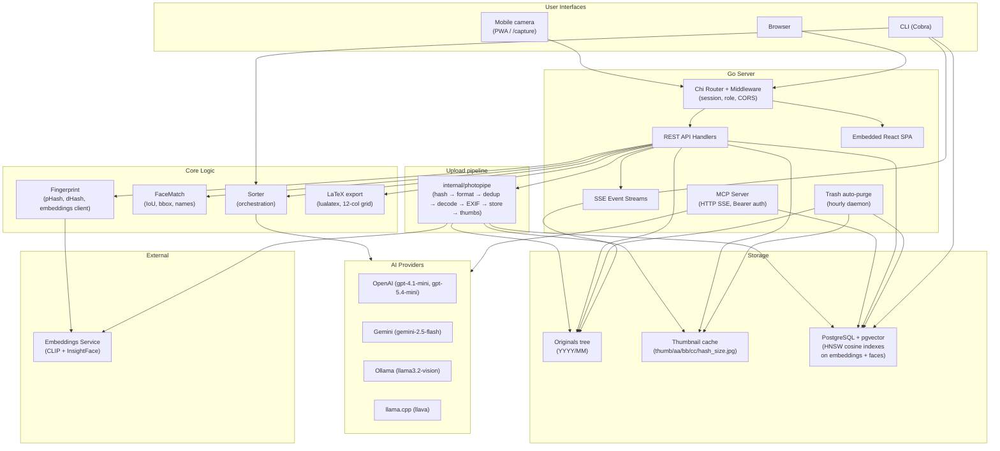

# Architecture

## Overview

Photo Sorter is a self-contained photo management application — one Go binary, one Postgres database (with pgvector), and an external CLIP/InsightFace embeddings service. PostgreSQL is the single source of truth for photos, albums, labels, subjects, markers, faces, photo books, sessions, and user accounts. Originals live on disk under `STORAGE_ORIGINALS_PATH` in `YYYY/MM/<filename>` (same shape PhotoPrism uses, so an existing PhotoPrism tree can be migrated in place without renaming); thumbnails live under `STORAGE_CACHE_PATH/thumb/<aa>/<bb>/<cc>/<hash>_<size>.jpg`. The backend is written in Go (Cobra CLI, Chi HTTP router, pgvector for vector storage) and the frontend is a React + TypeScript + TailwindCSS single-page application embedded into the Go binary at compile time.

> Backup and restore: see [`docs/backup.md`](backup.md) for the operator runbook covering what to back up (originals + Postgres), what to skip (thumbnail cache, build artefacts), and the disaster-recovery procedure.

## System Diagram


```mermaid
flowchart TB
    subgraph User["User Interfaces"]
        CLI["CLI (Cobra)"]
        Browser["Browser"]
        Mobile["Mobile camera<br/>(PWA / /capture)"]
    end

    subgraph Server["Go Server"]
        Router["Chi Router + Middleware<br/>(session, role, CORS)"]
        Handlers["REST API Handlers"]
        SSE["SSE Event Streams"]
        SPA["Embedded React SPA"]
        MCP["MCP Server<br/>(HTTP SSE, Bearer auth)"]
        TrashD["Trash auto-purge<br/>(hourly daemon)"]
    end

    subgraph Pipeline["Upload pipeline"]
        Pipe["internal/photopipe<br/>(hash → format → dedup → decode → EXIF → store → thumbs)"]
    end

    subgraph Core["Core Logic"]
        Sorter["Sorter<br/>(orchestration)"]
        FaceMatch["FaceMatch<br/>(IoU, bbox, names)"]
        Fingerprint["Fingerprint<br/>(pHash, dHash, embeddings client)"]
        Latex["LaTeX export<br/>(lualatex, 12-col grid)"]
    end

    subgraph AI["AI Providers"]
        OpenAI["OpenAI (gpt-4.1-mini, gpt-5.4-mini)"]
        Gemini["Gemini (gemini-2.5-flash)"]
        Ollama["Ollama (llama3.2-vision)"]
        LlamaCpp["llama.cpp (llava)"]
    end

    subgraph Storage["Storage"]
        Disk["Originals tree<br/>(YYYY/MM)"]
        Cache["Thumbnail cache<br/>(thumb/aa/bb/cc/hash_size.jpg)"]
        PG["PostgreSQL + pgvector<br/>(HNSW cosine indexes<br/>on embeddings + faces)"]
    end

    subgraph External["External"]
        EmbSvc["Embeddings Service<br/>(CLIP + InsightFace)"]
    end

    CLI --> Sorter
    CLI --> PG
    CLI --> Disk

    Browser --> Router
    Mobile --> Router
    Router --> SPA
    Router --> Handlers
    Handlers --> SSE
    TrashD --> PG
    TrashD --> Disk
    TrashD --> Cache

    Handlers --> Sorter
    Handlers --> FaceMatch
    Handlers --> Fingerprint
    Handlers --> Pipe
    Handlers --> PG
    Handlers --> Disk
    Handlers --> Cache
    Handlers --> Latex

    MCP --> PG
    MCP --> AI

    Sorter --> AI

    Pipe --> Disk
    Pipe --> Cache
    Pipe --> PG
    Pipe --> EmbSvc

    Fingerprint --> EmbSvc
```

## Package Structure

| Package | Purpose | Key Types |
|---------|---------|-----------|
| `cmd/` | Cobra CLI commands (sort, albums, labels, upload, move, photo, cache, serve, backup, migrate-from-photoprism, migrate-verify, migrate-remap-references, etc.) | Root command, subcommands |
| `internal/ai/` | AI provider interface and implementations (OpenAI, Gemini, Ollama, llama.cpp) | `Provider`, `PhotoAnalysis`, `BatchPhotoRequest`, `Usage` |
| `internal/ai/prompts/` | Embedded prompt templates (photo analysis, date estimation, CLIP translation, text check, text rewrite, text consistency) | Embedded text files |
| `internal/audit/` | Append-only audit trail for every successful mutating request. `Logger` wraps the `database.AuditLogWriter` and pulls `user_uid` / IP / User-Agent from a per-request `RequestContext` injected by the audit middleware; handlers just call `audit.FromContext(ctx).Log(action, entityType, entityUID, metadata)` after a successful mutation. Failures to persist are WARN-logged and never propagated so the underlying request still succeeds. Authentication-side events use `LogAs` (explicit user_uid for the `login` row) and `LogAnonymous` (no user_uid, plus an `actor` hint in metadata for `login_failed` / `share_link_password_failed`). | `Logger`, `RequestContext`, `WithRequestContext`, `WithLogger`, `FromContext`, action / entity constants |
| `internal/auth/` | Bcrypt password hashing, role constants (`admin`/`editor`/`viewer`), bootstrap-admin creation from env vars, and the long-lived read-only API token primitives (generation + SHA-256 hashing, `psat_` prefix) | `HashPassword`, `CheckPassword`, `BootstrapAdmin`, `RoleAdmin`, `GenerateAPIToken`, `HashAPIToken`, `IsAPIToken`, ... |
| `internal/config/` | Environment-based configuration loader and pricing data | `Config`, `StorageConfig`, `DuplicateConfig`, `prices.yaml` (embedded) |
| `internal/constants/` | Shared constants for page sizes, thresholds, concurrency limits, upload limits | Constants |
| `internal/database/` | Repository interfaces, cosine distance helper, text check/version stores. Similarity search runs against pgvector (`vector_cosine_ops` HNSW indexes); see [`similarity-search.md`](similarity-search.md). | `FaceReader`, `FaceWriter`, `EmbeddingReader`, `BookReader`/`BookWriter`, `PhotoReader`/`PhotoWriter`, `AlbumReader`/`AlbumWriter`, `LabelReader`/`LabelWriter`, `SubjectReader`/`SubjectWriter`, `MarkerReader`/`MarkerWriter`, `UserReader`/`UserWriter`, `PHashReader`/`PHashWriter`, `ShareLinkReader`/`ShareLinkWriter`, `SmartAlbumReader`/`SmartAlbumWriter`, `PhotoEditsReader`/`PhotoEditsWriter`, `AuditLogReader`/`AuditLogWriter`, `PhotoRelationReader`, `APITokenReader`/`APITokenWriter`, `PhotoCursor` |
| `internal/database/postgres/` | PostgreSQL backend with pgvector, auto-applied migrations (`migrations/*.sql` embedded at compile time), session persistence, audit-log writer, share/smart-album/photo-edit repositories, full-text-search query builder | `EmbeddingRepository`, `FaceRepository`, `BookRepository`, `PhotoRepository`, `AlbumRepository`, `LabelRepository`, `SubjectRepository`, `MarkerRepository`, `UserRepository`, `SessionStore`, `ShareLinkRepository`, `SmartAlbumRepository`, `PhotoEditsRepository`, `AuditLogRepository` |
| `internal/database/mariadb/` | Legacy MariaDB pool used only by the PhotoPrism-era `cache push-embeddings` CLI command. No runtime code path opens it. | `Pool` |
| `internal/database/mock/` | In-memory mocks of every repository interface, used exclusively by handler and storage tests. | `MockEmbeddingReader`, `MockFaceReader`, ... |
| `internal/exif/` | EXIF reader (`exiftool` subprocess + pure-Go fallback) and XMP sidecar writer used by `PUT /photos/{uid}/exif` | `Read`, `WriteSidecar` |
| `internal/facematch/` | Face matching utilities: IoU computation, bounding box conversion, name normalization | `NormalizePersonName`, IoU functions |
| `internal/fingerprint/` | Perceptual hash computation (pHash, dHash) and embeddings HTTP client | `Fingerprint`, embedding client |
| `internal/imgconvert/` | Format detection + thin wrappers around external decoders (`heif-convert` for HEIC/HEIF, `dcraw` for RAW) that produce an intermediate JPEG the rest of the pipeline can decode | `EnsureDecodable`, `DetectFormat`, `ErrConverterMissing` |
| `internal/imgedit/` | Non-destructive photo edits (crop → rotate → brightness → contrast). Stateless: `ApplyEdits(image.Image, PhotoEdits)` returns a new image; `DecodeAndApply` is the disk-aware wrapper used by the `PUT /photos/{uid}/edits` handler, the edited-download stream, and the LaTeX book export when fetching photos. Edits live in the `photo_edits` table (migration 041); the original file on disk is never modified. | `PhotoEdits`, `CropRect`, `ApplyEdits`, `DecodeAndApply`, `EncodeJPEG`, `ErrUnsupportedFormatNoDecoder` |
| `internal/latex/` | PDF export via LaTeX — markdown-to-LaTeX conversion, layout validation, 12-column grid system, font registry (24 free fonts: Google Fonts + CTAN + URW Bookman) | `LayoutConfig`, `FormatSlotsGrid`, `FontEntry`, markdown converter |
| `internal/mcp/` | MCP (Model Context Protocol) server exposing photo book, photo, album, label, and text tools for AI agents | `Server`, tool handlers (books, sections, pages, photos, albums, labels, text) |
| `internal/migrate/` | One-shot PhotoPrism → native migrator (reads PhotoPrism MariaDB and primary files, writes the native schema in stages); used only by the migration CLI commands | `Runner`, stage definitions |
| `internal/photopipe/` | Native upload pipeline: buffer → hash → format detect → exact-duplicate check → decode → EXIF → near-duplicate scan (pHash + embedding) → originals write → DB rows → thumbnails → pHash persist | `Pipeline`, `Options`, `IngestResult`, `DuplicateMatch`, `DuplicateDetectionOptions` |
| `internal/photoprism/` | PhotoPrism REST API client; retained only to drive the migration commands. No runtime code path calls it. | `PhotoPrism`, `Album`, `Photo`, `Label`, `Marker`, `Subject` |
| `internal/sorter/` | Orchestrates photo fetching, AI analysis, and label application | `Sorter` |
| `internal/storage/` | On-disk layout: originals (`YYYY/MM/<filename>`) and the thumbnail cache (`thumb/<aa>/<bb>/<cc>/<hash>_<size>.jpg`). Owns path resolution, atomic writes, hashing | `Storage`, `OriginalRelPath`, `ThumbRelPath`, `WriteOriginal`, `HashFile` |
| `internal/thumb/` | Thumbnail registry (`fit_720`, `fit_1280`, `fit_1920`, ..., `tile_50`, ...) + `GenerateSizes` (decode once, resize many) | `Source`, `Size`, `GenerateSizes`, `SizeNames`, `IsValidSize` |
| `internal/trash/` | Soft-delete trash store and the hourly auto-purge daemon that hard-deletes archived photos older than `TRASH_RETENTION_DAYS` | `Store`, `Purge`, `RunDaemon` |
| `internal/verify/` | Cell-by-cell comparator used by `migrate-verify` (PhotoPrism rows vs native rows, with tolerance bands) | `Verify`, `Report`, `FieldDiff` |
| `internal/web/` | Web server setup, route registration, in-process timeout middleware. Mounts the MCP handler at `/mcp/*` when present and the embedded React SPA at `/*` for everything that does not match an API route. | `Server` |
| `internal/web/static/` | Holds the embedded SPA build — `//go:embed all:dist/*` wraps the Vite output and `GetFileSystem` / `HasDist` expose it to the router. `make build` populates `dist/` from `web/` before the Go build runs. | `GetFileSystem`, `HasDist` |
| `internal/web/middleware/` | HTTP middleware: session cookie + role auth, CORS allowlist, security headers (CSP / X-Frame-Options / X-Content-Type-Options), audit logger injection, per-request opt-out from the server-level write deadline (for SSE / large PDF / upload), legacy PhotoPrism proxy guard | `SessionManager`, `RequireAuth`, `RequireRole`, `WithAuditLogger`, `CORS`, `SecurityHeaders`, `NoWriteDeadline` |
| `internal/web/handlers/` | REST API handlers and in-memory job managers for every endpoint group — albums, photos (incl. browse histogram + geo + EXIF + edits), labels, faces, subjects, books (incl. PDF export job manager + TTL sweeper), text AI, text versions, sort jobs, upload jobs, process jobs (embeddings/faces and build-thumbs reuse the same manager), share links + public share endpoints, smart albums, users + self, audit log, stats, config, SSE | `FacesHandler`, `BooksHandler`, `TextHandler`, `TextVersionsHandler`, `UsersHandler`, `PhotosHandler`, `AlbumsHandler`, `LabelsHandler`, `ShareHandler`, `SmartAlbumsHandler`, `AuditLogHandler`, `BookExportJobManager`, `UploadJobManager`, `ProcessJobManager`, `JobManager` |
| `web/` | React + TypeScript + TailwindCSS frontend (Vite build, i18n with Czech + English) | Pages, components, hooks, typed API client |

## Data Flow

### 1. Photo Upload (Web UI / CLI / mobile capture)

```
Multipart upload arrives at POST /api/v1/upload (or /upload/job for SSE progress)
    |
    v
internal/photopipe.Ingest(...)
    +-- Buffer the upload to a temp file
    +-- Compute SHA256 ("file_hash")
    +-- DetectFormat (jpeg / png / webp / tiff / gif / heic / raw / unknown)
    +-- Exact-duplicate check: if photos.file_hash row exists → return existing
    +-- HEIC/RAW: imgconvert.EnsureDecodable → JPEG intermediate
    +-- internal/exif.Read (exiftool subprocess + pure-Go fallback)
    +-- Optional near-duplicate scan:
    |     +-- pHash hamming distance via internal/fingerprint
    |     +-- CLIP embedding cosine distance via pgvector
    +-- internal/storage.WriteOriginal → originals/YYYY/MM/<basename>
    +-- Insert rows: photos, photo_files, photo_phashes
    +-- internal/thumb.GenerateSizes (decode once, write every registered size)
    +-- Embeddings + face detection (deferred to the Process job by default)
```

### 2. Photo Sorting (CLI or Web)

```
User triggers sort (CLI command or POST /api/v1/sort)
    |
    v
Sorter receives album UID + options (provider, concurrency, dry-run, etc.)
    |
    v
Sorter fetches photo list from the native photos table (album_uid filter)
    |
    v
For each photo (parallel, up to N concurrency):
    +-- Download image bytes from the originals tree
    +-- Send image + metadata to AI Provider (AnalyzePhoto)
    +-- AI returns labels, description, optional date estimate
    |
    v
(Optional) EstimateAlbumDate: send all descriptions to AI for album-wide date
    |
    v
Apply results to the photo row (unless dry-run):
    +-- Replace labels (confidence > 80%)
    +-- Set description/caption
    +-- Set date if missing (or if --force-date)
    +-- Update notes with "Analyzed by: <model>"
```

Three processing modes are supported: **standard** (N parallel photo calls + 1 album date call), **individual-dates** (date estimated per photo in each call), and **batch** (OpenAI batch API: submit, poll, download — 50% cheaper but asynchronous).

### 3. Face Matching

```
Embeddings Service computes InsightFace embeddings (512-dim) for each face
    |
    v
Embeddings stored in PostgreSQL faces table with an HNSW index on `embedding`
    |
    v
On match request (POST /api/v1/faces/match):
    +-- Query pgvector for nearest neighbors via `ORDER BY embedding <=> $1` (see docs/similarity-search.md)
    +-- Fetch candidate face records from PostgreSQL
    +-- Match InsightFace bboxes to native markers via IoU (threshold >= 0.1)
    +-- Return ranked suggestions with actions (create_marker, assign_person)
    |
    v
On apply (POST /api/v1/faces/apply):
    +-- Create or update the native marker with assigned subject
```

### 4. Web Request Flow

```
Browser sends request
    |
    v
Chi Router
    +-- Security headers middleware (CSP, X-Frame-Options, etc.)
    +-- CORS middleware
    +-- Static file serving (embedded React SPA for non-API routes)
    |
    v
For /api/v1/* routes:
    +-- RequireAuth middleware (validates session cookie, adds AuthInfo to context)
    +-- WithAuditLogger middleware (installs audit.Logger + RequestContext)
    +-- RequireRole gate (admin / editor / viewer) for write paths
    |
    v
Handler function
    +-- Reads session + role from context
    +-- Calls native repositories / pgvector / storage as needed
    +-- Returns JSON response via respondJSON / respondError
    |
    v
For long-running jobs (sort, process, upload, book export):
    +-- Handler starts background goroutine
    +-- Returns job ID immediately
    +-- Client connects to SSE endpoint (GET .../events)
    +-- Events streamed until job completes or client disconnects
```

### 5. Trash + auto-purge

```
User archives photos (POST /api/v1/photos/batch/archive)
    +-- photos.archived_at = NOW()
    +-- Photos are excluded from default listings; visible at /api/v1/photos/trash
    |
    v
Hourly internal/trash daemon (launched by cmd/serve.go):
    +-- Selects photos with archived_at < NOW() - TRASH_RETENTION_DAYS
    +-- Hard-deletes the photo row (cascades to phashes, markers, files,
    |   album_photos, photo_labels), the embedding, every cached face row,
    |   the on-disk original, and every cached thumbnail size
    +-- Logs the deleted count and cutoff timestamp
```

The same logic is exposed admin-only at `POST /api/v1/photos/batch/purge` so an operator can force a purge before the timer fires.

### 6. Audit log

Every successful mutating handler appends a row to `audit_log` via the `audit.Logger` carried on the request context. The `WithAuditLogger` middleware installs the logger plus a `RequestContext` (user UID, IP, User-Agent) for every request, so a handler that finishes a write just calls `audit.FromContext(ctx).Log(action, entityType, entityUID, metadata)` — no further plumbing. Authentication paths use `LogAs` (explicit user UID for `login`) and `LogAnonymous` (with an `actor` metadata hint for `login_failed` / `share_link_password_failed`). Batch operations record a single row with `metadata.count`, so bulk endpoints do not flood the table. Persistence failures WARN-log and never abort the request. Reads are admin-only via `GET /api/v1/audit-log` with filters for user, action, entity, and time range.

### 7. Non-destructive photo edits

`PUT /api/v1/photos/{uid}/edits` upserts a row in `photo_edits` (crop, rotation, brightness, contrast). The original file on disk is never touched. On save the handler synchronously rebuilds every registered thumbnail size from the post-edit pixels via `internal/imgedit.DecodeAndApply` + `internal/thumb.GenerateSizesFromImage`; on HEIC/RAW originals without a matching decoder the row is rolled back and the request returns 503. Downloads default to a freshly-rendered JPEG (`?original=true` bypasses to the pristine file), and the LaTeX book export pulls photos through the same `DecodeAndApply` path so prints respect the saved edits. `DELETE /photo_edits` is idempotent and rebuilds thumbnails from the un-edited pixels.

## Database Schema

Auto-applied migrations live in `internal/database/postgres/migrations/` (embedded at compile time via `//go:embed`). They run in numeric order on startup against the connection in `DATABASE_URL`. The current schema covers:

| Table | Migration | Purpose |
|-------|-----------|---------|
| `users` | 032 | Native auth: bcrypt hash, role (`admin`/`editor`/`viewer`), disabled flag, last login. Source of every actor UID referenced elsewhere. |
| `sessions` | 006, extended by 018 (`user_uid`) and 033 (`role`) | Server-side session store for the web cookie. Survives restarts. |
| `photos` | 032 (+ 035 FTS column, 036 extra metadata) | Photo metadata, EXIF blob, location, archived_at, uploader. Czech-aware FTS lives in a generated `tsvector` column with a GIN index (migration 035). |
| `photo_files` | 032 | Physical files per photo (RAW/JPEG/edited). Exactly one `is_primary`. |
| `photo_phashes` | 034 | pHash / dHash per photo for near-duplicate scans. |
| `albums` + `album_photos` | 032 (+ 037 extra metadata) | User-curated and auto-generated groupings + their join table. |
| `labels` + `photo_labels` | 032 (+ 037 extra metadata) | AI / user labels and the join to photos. |
| `subjects` | 032 (+ 037 extra metadata) | People referenced by markers + the face-recognition flow. |
| `markers` | 032 | Native face/object markers (display-space bbox, optional subject). |
| `embeddings` | 001, HNSW index from 038 | 768-dim CLIP vectors. One row per photo. |
| `faces` | 002, HNSW index from 038 | 512-dim InsightFace embeddings with cached marker metadata. |
| `faces_processed` | 003 | Tracks which photos have been through face detection. |
| `era_embeddings` | 007 | 768-dim CLIP centroids for era estimation. |
| `photo_books` | 008, typography columns from 021–024, 029 | Photo books with title, description, typography settings (fonts, sizes, line height, caption opacity, heading bleed, caption badge size, body text padding). |
| `book_chapters` | 016, `color` from 020, `hide_from_toc` from 031 | Optional grouping above sections. |
| `book_sections` + `section_photos` | 008 | Sections + their photo pool. |
| `book_pages` | 008, formats 009/011/027, `style` 013, `split_position` 014, `hide_page_number` 025 | Pages with format, optional split position, per-page folio suppression. |
| `page_slots` | 008, text content 012, crop 014/015, captions slot 026, contents slot 030 | Holds a photo, text, captions-aggregator, or contents-aggregator (mutually exclusive). |
| `text_versions` | 017 | Append-only history for book text fields with restore support. |
| `text_check_results` | 019, `suggestions JSONB` from 028 | Cached AI text-check results keyed on `(source_type, source_id, field, content_hash)`. |
| `album_share_links` | 039, `created_by_user_uid` FK relaxed by 043 | Public share slugs with optional bcrypt password + expiry; deleting the minter `SET NULL`s the FK. |
| `smart_albums` | 040, `created_by_user_uid` FK relaxed by 043 | Saved photo searches (filter JSON re-played at request time). |
| `photo_edits` | 041 | Non-destructive crop / rotate / brightness / contrast per photo. Row exists only when at least one parameter is non-default. |
| `audit_log` | 042, `user_uid` FK `SET NULL` from 043 | Append-only audit trail for every mutating action plus auth-failure events. |
| `api_tokens` | 044 | Long-lived read-only bearer tokens for machine clients (the migration exporter). Stores only the SHA-256 of the token; `scope` is `read`; soft-revoked via `revoked_at`. `created_by_user_uid` FK is `ON DELETE SET NULL`. |

Cross-cutting bits: `unaccent` (migration 005) powers diacritic-folded searches; the 038 HNSW indexes are `vector_cosine_ops` and queries `SET LOCAL hnsw.ef_search = 100` (see [`similarity-search.md`](similarity-search.md)); migration 043 relaxes every `user_uid` FK to `ON DELETE SET NULL` so deleting a user preserves history; migration 045 adds `idx_photos_updated_at_uid (updated_at, uid)`, whose column order matches the `sort=updated` ORDER BY exactly so the incremental-export keyset seek and its ordering come from one index scan.

## Background Jobs and Daemons

Long-running work runs in goroutines owned by the `serve` process and surfaces progress through Server-Sent Events. Each job kind has a small in-memory manager (no persistence across restarts); a client reconnects by polling the status endpoint after a transient drop.

| Job kind | Manager | Concurrency | Routes |
|----------|---------|-------------|--------|
| Sort (AI label/description/date) | `handlers.JobManager` | Multiple jobs in flight | `POST /api/v1/sort`, `GET /api/v1/sort/{jobId}`, `GET /api/v1/sort/{jobId}/events`, `DELETE /api/v1/sort/{jobId}` |
| Upload (multipart background) | `handlers.UploadJobManager` | One at a time | `POST /api/v1/upload/job`, `GET /api/v1/upload/{jobId}/events`, `DELETE /api/v1/upload/{jobId}` |
| Process (embeddings + face detection) | `handlers.ProcessJobManager` | One at a time | `POST /api/v1/process`, `GET /api/v1/process/{jobId}/events`, `DELETE /api/v1/process/{jobId}` |
| Build thumbs (admin backfill) | Shared with `ProcessJobManager` | One at a time | `POST /api/v1/process/build-thumbs` (events stream via `/process/{jobId}/events`) |
| Book PDF export | `handlers.BookExportJobManager` | One per book; TTL sweeper | `POST /api/v1/books/{id}/export-pdf/job`, `GET /api/v1/book-export/{jobId}/events`, `GET /api/v1/book-export/{jobId}/download`, `DELETE /api/v1/book-export/{jobId}` |

Two background goroutines run without an HTTP entry point:

- **Trash auto-purge** (`cmd/serve.go` → `internal/trash.RunDaemon`). Wakes hourly, deletes photos whose `archived_at` is older than `TRASH_RETENTION_DAYS` (default 30), and cascades to phashes / markers / files / album_photos / photo_labels / embeddings / faces / on-disk originals / cached thumbnails.
- **Book export TTL sweeper** (`handlers.BookExportJobManager.sweepLoop`). Drops finished export jobs + their temp PDFs after a fixed TTL.
- **Embedding-service health probe** (`internal/metrics.Registry.StartEmbeddingProbe`). Every 30 s while `EMBEDDING_URL` is set, fires a 5 s-timeout GET against the embedding service and updates `photo_sorter_embedding_service_up`. State transitions are logged once each (suppressed otherwise).
- **Backup freshness watcher** (`internal/metrics.Registry.StartBackupWatcher`). Every 10 min, scans `METRICS_BACKUP_DIR` (defaults to `/mnt/nas-botka/backups/photo-sorter`) for the newest `metadata.json` and publishes its `created_at` as `photo_sorter_last_backup_timestamp_seconds`. Drives the `PhotoSorterBackupStale` alert.

## Metrics & alerting

`internal/metrics/` exposes a Prometheus registry on `GET /metrics` (no auth — assumed LAN/Tailscale only). The `serve` command constructs a `metrics.Registry`, installs a middleware on the chi router (HTTP request totals, duration histogram, in-flight gauge), wires a `sql.DB.Stats()` collector for the pgvector pool, and kicks off the embedding probe + backup watcher described above. Job lifecycle counters (`photo_sorter_jobs_{started,completed,failed,cancelled}_total{kind=...}`) are incremented from the four job managers (`upload`, `sort`, `process`, `book_export`).

The scrape config and alert rules live in the [`rpi`](../../rpi/) repo: `mimir/config/alloy.config.alloy` adds a `photo-sorter` scrape job pointed at `localhost:5112/metrics`, and `mimir/rules/photo-sorter.yaml` defines the five alerts (`PhotoSorterDown`, `PhotoSorterHigh5xxRate`, `PhotoSorterDBPoolSaturated`, `PhotoSorterBackupStale`, `PhotoSorterEmbeddingServiceDown`). Host-level disk-fill is already covered by `HostOutOfDiskSpace` in `node-exporter.yaml`.

## MCP Server

When `MCP_API_TOKEN` is set, `cmd/serve.go` mounts a Model Context Protocol server on the same HTTP listener at `/mcp/*` (the registered subroutes are `/mcp/sse` for the event stream and `/mcp/message` for client posts). Authentication is `Authorization: Bearer <MCP_API_TOKEN>` enforced by `mcp.BearerAuthMiddleware`. The handler exposes ~52 tools across photo books, photo / album / label / subject operations, and AI text tools — implementations live in one file per surface (`internal/mcp/books.go`, `sections.go`, `pages.go`, `photos.go`, `albums.go`, `labels.go`, `text.go`). The book-side surface is at parity with the web book API for everything except heavy ops (auto-layout, preflight, and the PDF export job flow remain web-only). With the env var unset, no MCP routes are registered and the rest of the server is unaffected.

## Key Design Decisions

| Decision | Rationale | Trade-offs |
|----------|-----------|------------|
| **pgvector HNSW indexes as the only similarity-search layer** | One source of truth for cosine search keeps `pg_dump` a complete metadata backup, drops in-process memory to the pool overhead, and makes shutdown an HTTP-drain + pool-close (no index serialization). Per-query latency is comfortable for the interactive features that previously justified an in-process cache. | Lose the ~15× speedup we had from the in-memory layer on batch features. Bulk ops compensate by issuing N parallel queries against the same pgvector pool. |
| **Embedded frontend in Go binary** | Single binary deployment with no external file dependencies. `go:embed` bundles the built React app at compile time. | Requires full rebuild (`make build`) for any frontend change. Development mode uses separate Vite dev server for hot reload. |
| **Native user accounts with cookie sessions** | Photo-sorter owns its own `users` table (bcrypt) and 30-day signed cookie sessions persisted in Postgres. First admin is bootstrapped from `BOOTSTRAP_ADMIN_USERNAME` / `BOOTSTRAP_ADMIN_PASSWORD` on a fresh install; subsequent users are managed via `/api/v1/users/*`. Roles (`admin`/`editor`/`viewer`) gate write paths. | Operators must seed the bootstrap admin (the server warns and starts anyway if either env var is missing). Sessions survive restarts. |
| **Migration export: keyset cursor, not OFFSET** | `GET /photos?sort=updated&cursor=` orders by `(updated_at, uid)` ascending and resumes with a row-value predicate. OFFSET pagination cannot survive a long export — rows shift under the offset as photos are written, so pages silently skip and repeat. Walking `updated_at` *forwards* also means a photo written mid-export moves ahead of the cursor and re-appears later rather than being lost. | A client can see the same photo twice (harmless: an import upserts by UID). The cursor is only valid under `sort=updated`, and any `ts_rank` ordering from `q` must be dropped there, since a relevance key ahead of the pair would invalidate the keyset. |
| **Read-only API token for machine clients** | An export job must not depend on a 30-day session that the cleanup loop can delete mid-run. `api_tokens` holds long-lived `psat_`-prefixed bearer tokens, stored as SHA-256 (not bcrypt: 256 bits of `crypto/rand` has no structure to brute-force, and a bcrypt round on every request would add ~100 ms of CPU to a 20k-photo export). Read-only is enforced three ways — viewer role, `requireWriteRole`, and an unsafe-method rejection in `RequireAuth`. | Managed from the CLI only; there is no REST surface to mint a token, deliberately. The auth path costs one indexed SELECT per request (no in-memory cache), which is the price of immediate revocation. |
| **Native upload pipeline** | `internal/photopipe` owns the full ingestion path: hash → format detect → exact-duplicate check (by SHA256) → decode → EXIF → near-duplicate scan → write originals → DB rows → thumbnails. Reusable from HTTP, CLI, and migration code without involving any external service. | RAW/HEIC require external decoders (`dcraw`, `heif-convert`) which the Docker image bundles; self-builders must install them. |
| **SSE for job progress** | Sort, process, upload, and book export jobs run for minutes. Server-Sent Events provide real-time progress without polling or WebSocket complexity. Unidirectional server-to-client fits the use case. | No bidirectional communication. Client must reconnect on disconnect. Jobs use an in-memory listener pattern (not persisted across restarts). |
| **Dual coordinate space handling for faces** | Both native markers and InsightFace embeddings use display-space coordinates. EXIF orientations 5-8 (90-degree rotations) require swapping raw file dimensions. A single conversion function handles this. | Coordinate bugs are subtle; IoU matching depends on both sources being in the same space. |
| **PostgreSQL with pgvector for all storage** | Single database for photos, albums, labels, subjects, markers, embeddings (768-dim CLIP), faces (512-dim ResNet100), era centroids, sessions, users, photo books, text-check results. Auto-applied migrations on startup. | Requires PostgreSQL 15+ with pgvector extension. Not portable to SQLite or other databases without significant rework. |
| **PhotoPrism-style on-disk layout** | Originals live under `YYYY/MM/<filename>` and the thumbnail cache uses `thumb/<aa>/<bb>/<cc>/<hash>_<size>.jpg` (hash-sharded). An existing PhotoPrism originals tree can be reused in place; `migrate-from-photoprism` only copies bytes if it has to. | The 3-byte hash shard adds directory depth but keeps any one folder bounded. |
| **AI prompts in Czech with location context** | Prompts assume photos are from a specific Czech location (Veselice, Jihomoravsky kraj). Descriptions are generated in Czech. | Tightly coupled to the operator's use case. Would need prompt customization for other locales. |

## Configuration

Environment variables grouped by service:

### Storage + identity
| Variable | Required | Description |
|----------|----------|-------------|
| `STORAGE_ORIGINALS_PATH` | No | Originals root (default `/data/originals` in Docker, `./data/originals` in dev). Layout: `YYYY/MM/<filename>`. |
| `STORAGE_CACHE_PATH` | No | Thumbnail cache root (default `/data/cache` in Docker, `./data/cache` in dev). Layout: `thumb/<aa>/<bb>/<cc>/<hash>_<size>.jpg`. |
| `BOOTSTRAP_ADMIN_USERNAME` | No | Username for the first admin auto-created on a fresh install. |
| `BOOTSTRAP_ADMIN_PASSWORD` | No | Password for the first admin. Bootstrap is skipped (with a WARN) if either variable is missing and no users exist. |

### Trash + duplicate detection
| Variable | Required | Description |
|----------|----------|-------------|
| `TRASH_RETENTION_DAYS` | No | Retention window for the soft-delete trash (default 30). The hourly auto-purge daemon hard-deletes archived photos older than this. |
| `DUPLICATE_CHECK_ENABLED` | No | `true`/`false` global gate for the upload-time near-duplicate scan (default `true`). |
| `DUPLICATE_PHASH_MAX_DIFF` | No | Max hamming distance (0..64) between pHashes for the near-duplicate scan (default 8). |
| `DUPLICATE_EMBEDDING_MAX_DIST` | No | Max cosine distance (0..2) between CLIP embeddings for the near-duplicate scan (default 0.05). |

### AI Providers
| Variable | Required | Description |
|----------|----------|-------------|
| `OPENAI_TOKEN` | No* | OpenAI API key |
| `GEMINI_API_KEY` | No* | Google Gemini API key |
| `OLLAMA_URL` | No | Ollama server URL (default: `http://localhost:11434`) |
| `OLLAMA_MODEL` | No | Ollama model name (default: `llama3.2-vision:11b`) |
| `LLAMACPP_URL` | No | llama.cpp server URL (default: `http://localhost:8080`) |
| `LLAMACPP_MODEL` | No | llama.cpp model name (default: `llava`) |

*At least one AI provider must be configured for the sort command and the text-AI surface.

### Database
| Variable | Required | Description |
|----------|----------|-------------|
| `DATABASE_URL` | Yes | PostgreSQL connection string with pgvector |
| `DATABASE_MAX_OPEN_CONNS` | No | Max open connections (default: 25) |
| `DATABASE_MAX_IDLE_CONNS` | No | Max idle connections (default: 5) |

### Embeddings
| Variable | Required | Description |
|----------|----------|-------------|
| `EMBEDDING_URL` | No | Embeddings service URL (default: `http://localhost:8000`) |
| `EMBEDDING_DIM` | No | Embedding dimensions (default: 768) |

### Web Server
| Variable | Required | Description |
|----------|----------|-------------|
| `WEB_PORT` | No | Server port (default: 8080) |
| `WEB_HOST` | No | Server host (default: `0.0.0.0`) |
| `WEB_SESSION_SECRET` | No | Secret for signing session cookies (warns if unset) |
| `WEB_ALLOWED_ORIGINS` | No | Comma-separated CORS allowed origins |

### MCP Server
| Variable | Required | Description |
|----------|----------|-------------|
| `MCP_API_TOKEN` | No | Bearer token for MCP client authentication (enables MCP endpoint at `/mcp/sse` on `serve` command) |

## External Decoders

The native upload + EXIF pipelines shell out to three external binaries that must be on `PATH`:

| Binary | Used by | Purpose |
|--------|---------|---------|
| `dcraw` | `internal/imgconvert/raw.go` | Decode RAW originals (CR2/CR3/NEF/ARW/DNG/RAF/ORF/RW2/PEF/SRW) to a PPM frame the pipeline re-encodes as JPEG |
| `heif-convert` | `internal/imgconvert/heif.go` | Decode HEIC/HEIF originals to JPEG |
| `exiftool` | `internal/exif/exiftool.go`, `internal/exif/sidecar.go` | Read EXIF on upload (with a pure-Go fallback) and write XMP sidecars next to originals on EXIF edits |

The official Docker image bundles all three. The runtime stage installs Alpine's `libheif-tools`, `exiftool`, and `libraw-tools` packages, plus a small `scripts/dcraw-shim.sh` wrapper that emulates the `dcraw -c -w -h` invocation our Go code uses on top of LibRaw's `dcraw_emu` (Alpine dropped the upstream `dcraw` package; LibRaw is the maintained replacement). Self-builders running the binary outside Docker must install equivalents themselves. The `serve` command logs a `WARN` line on startup for each missing binary and a single `startup: external decoders OK` line when all three are present, so a broken image regresses loudly instead of silently failing at upload time.

## Deployment

Photo-sorter ships through two distribution channels that both rely on
the same single Go binary (the frontend is embedded via `go:embed`):

- **Docker image** at `ghcr.io/kozaktomas/photo-sorter`. Built and
  pushed by `.github/workflows/docker-publish.yml` on every push to
  `main` and on `v*.*.*` tags. The runtime stage bundles `exiftool`,
  `heif-convert` (via `libheif-tools`), a `dcraw_emu` shim, all 24
  free book-typography fonts, and the lualatex pieces needed for PDF
  export. Configuration is fully env-driven; mount a host directory at
  `/data` to persist originals + thumbnail cache. Most relevant env
  vars: `DATABASE_URL`, `STORAGE_ORIGINALS_PATH=/data/originals`,
  `STORAGE_CACHE_PATH=/data/cache`, `EMBEDDING_URL`,
  `BOOTSTRAP_ADMIN_USERNAME`/`BOOTSTRAP_ADMIN_PASSWORD`,
  `WEB_SESSION_SECRET`.
- **Debian / Ubuntu `.deb` package** for `amd64` and `arm64`, built
  by `.github/workflows/release.yml` via goreleaser + nfpm on tag
  push. The package layout is defined in `.goreleaser.yaml` and the
  `deb/` directory: the binary lands at `/usr/bin/photo-sorter`, the
  systemd unit at `/lib/systemd/system/photo-sorter.service`, the
  sample env conffile at `/etc/photo-sorter/photo-sorter.env`, and the
  bundled fonts under `/usr/local/share/fonts/photo-sorter/`. The
  postinstall creates a `photo-sorter` system user and the
  `/var/lib/photo-sorter/{originals,cache}` state directories, refreshes
  the fontconfig cache, and enables (but does not start) the unit.
  Operators set `DATABASE_URL` + `WEB_SESSION_SECRET` in the env file
  before `systemctl start photo-sorter`. Runtime dependencies declared
  on the deb (`texlive-luatex`, `libimage-exiftool-perl`,
  `libheif-examples | libheif-bin`, `dcraw`, `postgresql-client`,
  `fontconfig`, etc.) are resolved by `apt` on install.

Both channels are intentionally kept in lock-step: tagging `v1.2.3`
fires both workflows. Updating runtime tooling (a new system binary the
upload pipeline shells out to) means updating both the Dockerfile
**and** the `nfpms.dependencies` list in `.goreleaser.yaml`.

## Error Handling Strategy

Errors flow through the system in three distinct patterns:

**1. Wrapped errors in Go code.** Internal packages return errors wrapped with `fmt.Errorf("context: %w", err)`, preserving the error chain. Repository methods return typed sentinels (`database.ErrNotFound`, `database.ErrUsernameTaken`, etc.) so handlers can map them to HTTP statuses with `errors.Is`.

**2. HTTP error responses.** API handlers use a centralized `respondError(w, statusCode, message)` helper that returns JSON `{"error": "message"}`. The middleware stack short-circuits on auth failures (401), missing role (403), or context-resolution failures (500) before reaching handlers.

**3. SSE error events.** Long-running jobs (sort, process, upload, book export) run in background goroutines and communicate errors through typed SSE events. The frontend uses discriminated union types (`events.ts`) to handle each event type. If a job fails, a terminal event with error details is sent and the SSE stream closes. Clients reconnect by checking the job status endpoint.

Across all paths, errors from external services (embeddings service, AI providers) are caught at the handler or sorter level, logged with `sanitizeForLog` to prevent log injection, and surfaced to the user as structured JSON or SSE events.
