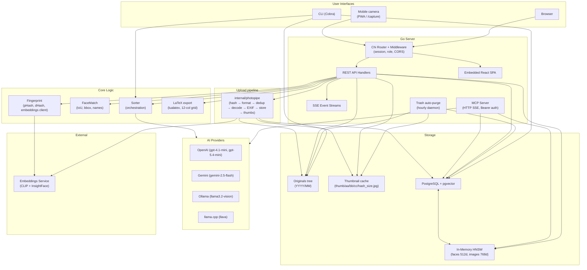

# Architecture

## Overview

Photo Sorter is a self-contained photo management application — one Go binary, one Postgres database (with pgvector), and an external CLIP/InsightFace embeddings service. PostgreSQL is the single source of truth for photos, albums, labels, subjects, markers, faces, photo books, sessions, and user accounts. Originals live on disk under `STORAGE_ORIGINALS_PATH` in `YYYY/MM/<filename>` (same shape PhotoPrism uses, so an existing PhotoPrism tree can be migrated in place without renaming); thumbnails live under `STORAGE_CACHE_PATH/thumb/<aa>/<bb>/<cc>/<hash>_<size>.jpg`. The backend is written in Go (Cobra CLI, Chi HTTP router, pgvector for vector storage) and the frontend is a React + TypeScript + TailwindCSS single-page application embedded into the Go binary at compile time.

## System Diagram


```mermaid
flowchart TB
    subgraph User["User Interfaces"]
        CLI["CLI (Cobra)"]
        Browser["Browser"]
        Mobile["Mobile camera<br/>(PWA / /capture)"]
    end

    subgraph Server["Go Server"]
        Router["Chi Router + Middleware<br/>(session, role, CORS)"]
        Handlers["REST API Handlers"]
        SSE["SSE Event Streams"]
        SPA["Embedded React SPA"]
        MCP["MCP Server<br/>(HTTP SSE, Bearer auth)"]
        TrashD["Trash auto-purge<br/>(hourly daemon)"]
    end

    subgraph Pipeline["Upload pipeline"]
        Pipe["internal/photopipe<br/>(hash → format → dedup → decode → EXIF → store → thumbs)"]
    end

    subgraph Core["Core Logic"]
        Sorter["Sorter<br/>(orchestration)"]
        FaceMatch["FaceMatch<br/>(IoU, bbox, names)"]
        Fingerprint["Fingerprint<br/>(pHash, dHash, embeddings client)"]
        Latex["LaTeX export<br/>(lualatex, 12-col grid)"]
    end

    subgraph AI["AI Providers"]
        OpenAI["OpenAI (gpt-4.1-mini, gpt-5.4-mini)"]
        Gemini["Gemini (gemini-2.5-flash)"]
        Ollama["Ollama (llama3.2-vision)"]
        LlamaCpp["llama.cpp (llava)"]
    end

    subgraph Storage["Storage"]
        Disk["Originals tree<br/>(YYYY/MM)"]
        Cache["Thumbnail cache<br/>(thumb/aa/bb/cc/hash_size.jpg)"]
        PG["PostgreSQL + pgvector"]
        HNSW["In-Memory HNSW<br/>(faces 512d, images 768d)"]
    end

    subgraph External["External"]
        EmbSvc["Embeddings Service<br/>(CLIP + InsightFace)"]
    end

    CLI --> Sorter
    CLI --> PG
    CLI --> Disk

    Browser --> Router
    Mobile --> Router
    Router --> SPA
    Router --> Handlers
    Handlers --> SSE
    TrashD --> PG
    TrashD --> Disk
    TrashD --> Cache

    Handlers --> Sorter
    Handlers --> FaceMatch
    Handlers --> Fingerprint
    Handlers --> Pipe
    Handlers --> PG
    Handlers --> HNSW
    Handlers --> Disk
    Handlers --> Cache
    Handlers --> Latex

    MCP --> PG
    MCP --> HNSW
    MCP --> AI

    Sorter --> AI

    Pipe --> Disk
    Pipe --> Cache
    Pipe --> PG
    Pipe --> EmbSvc

    Fingerprint --> EmbSvc

    PG <--> HNSW
```

## Package Structure

| Package | Purpose | Key Types |
|---------|---------|-----------|
| `cmd/` | Cobra CLI commands (sort, albums, labels, upload, move, photo, cache, serve, backup, migrate-from-photoprism, migrate-verify, migrate-remap-references, etc.) | Root command, subcommands |
| `internal/ai/` | AI provider interface and implementations (OpenAI, Gemini, Ollama, llama.cpp) | `Provider`, `PhotoAnalysis`, `BatchPhotoRequest`, `Usage` |
| `internal/ai/prompts/` | Embedded prompt templates (photo analysis, date estimation, CLIP translation, text check, text rewrite, text consistency) | Embedded text files |
| `internal/auth/` | Bcrypt password hashing, role constants (`admin`/`editor`/`viewer`), bootstrap-admin creation from env vars | `HashPassword`, `CheckPassword`, `BootstrapAdmin`, `RoleAdmin`, ... |
| `internal/config/` | Environment-based configuration loader and pricing data | `Config`, `StorageConfig`, `DuplicateConfig`, `prices.yaml` (embedded) |
| `internal/constants/` | Shared constants for page sizes, thresholds, concurrency limits, upload limits | Constants |
| `internal/database/` | Repository interfaces, HNSW index wrappers, cosine distance, text check/version stores | `FaceReader`, `FaceWriter`, `EmbeddingReader`, `BookReader`/`BookWriter`, `PhotoReader`/`PhotoWriter`, `AlbumReader`/`AlbumWriter`, `LabelReader`/`LabelWriter`, `SubjectReader`/`SubjectWriter`, `MarkerReader`/`MarkerWriter`, `UserReader`/`UserWriter`, `PHashReader`/`PHashWriter`, `HNSWIndex` |
| `internal/database/postgres/` | PostgreSQL backend with pgvector, migrations, session persistence | `EmbeddingRepository`, `FaceRepository`, `BookRepository`, `PhotoRepository`, `AlbumRepository`, `LabelRepository`, `SubjectRepository`, `MarkerRepository`, `UserRepository`, `SessionStore` |
| `internal/exif/` | EXIF reader (`exiftool` subprocess + pure-Go fallback) and XMP sidecar writer used by `PUT /photos/{uid}/exif` | `Read`, `WriteSidecar` |
| `internal/facematch/` | Face matching utilities: IoU computation, bounding box conversion, name normalization | `NormalizePersonName`, IoU functions |
| `internal/fingerprint/` | Perceptual hash computation (pHash, dHash) and embeddings HTTP client | `Fingerprint`, embedding client |
| `internal/imgconvert/` | Format detection + thin wrappers around external decoders (`heif-convert` for HEIC/HEIF, `dcraw` for RAW) that produce an intermediate JPEG the rest of the pipeline can decode | `EnsureDecodable`, `DetectFormat`, `ErrConverterMissing` |
| `internal/latex/` | PDF export via LaTeX — markdown-to-LaTeX conversion, layout validation, 12-column grid system, font registry (24 free fonts: Google Fonts + CTAN + URW Bookman) | `LayoutConfig`, `FormatSlotsGrid`, `FontEntry`, markdown converter |
| `internal/mcp/` | MCP (Model Context Protocol) server exposing photo book, photo, album, label, and text tools for AI agents | `Server`, tool handlers (books, sections, pages, photos, albums, labels, text) |
| `internal/migrate/` | One-shot PhotoPrism → native migrator (reads PhotoPrism MariaDB and primary files, writes the native schema in stages); used only by the migration CLI commands | `Runner`, stage definitions |
| `internal/photopipe/` | Native upload pipeline: buffer → hash → format detect → exact-duplicate check → decode → EXIF → near-duplicate scan (pHash + embedding) → originals write → DB rows → thumbnails → pHash persist | `Pipeline`, `Options`, `IngestResult`, `DuplicateMatch`, `DuplicateDetectionOptions` |
| `internal/photoprism/` | PhotoPrism REST API client; retained only to drive the migration commands. No runtime code path calls it. | `PhotoPrism`, `Album`, `Photo`, `Label`, `Marker`, `Subject` |
| `internal/sorter/` | Orchestrates photo fetching, AI analysis, and label application | `Sorter` |
| `internal/storage/` | On-disk layout: originals (`YYYY/MM/<filename>`) and the thumbnail cache (`thumb/<aa>/<bb>/<cc>/<hash>_<size>.jpg`). Owns path resolution, atomic writes, hashing | `Storage`, `OriginalRelPath`, `ThumbRelPath`, `WriteOriginal`, `HashFile` |
| `internal/thumb/` | Thumbnail registry (`fit_720`, `fit_1280`, `fit_1920`, ..., `tile_50`, ...) + `GenerateSizes` (decode once, resize many) | `Source`, `Size`, `GenerateSizes`, `SizeNames`, `IsValidSize` |
| `internal/trash/` | Soft-delete trash store and the hourly auto-purge daemon that hard-deletes archived photos older than `TRASH_RETENTION_DAYS` | `Store`, `Purge`, `RunDaemon` |
| `internal/verify/` | Cell-by-cell comparator used by `migrate-verify` (PhotoPrism rows vs native rows, with tolerance bands) | `Verify`, `Report`, `FieldDiff` |
| `internal/web/` | Web server setup and route registration | `Server` |
| `internal/web/middleware/` | HTTP middleware: auth (session cookie), role gating, CORS, session management | `SessionManager`, `RequireAuth`, `RequireRole` |
| `internal/web/handlers/` | REST API handlers for all endpoints (albums, photos, faces, books, text AI, text versions, sort jobs, SSE) | `FacesHandler`, `BooksHandler`, `TextHandler`, `TextVersionsHandler`, `UsersHandler`, `PhotosHandler`, `AlbumsHandler`, `LabelsHandler`, ... |
| `web/` | React + TypeScript + TailwindCSS frontend (Vite build, i18n with Czech + English) | Pages, components, hooks, typed API client |

## Data Flow

### 1. Photo Upload (Web UI / CLI / mobile capture)

```
Multipart upload arrives at POST /api/v1/upload (or /upload/job for SSE progress)
    |
    v
internal/photopipe.Ingest(...)
    +-- Buffer the upload to a temp file
    +-- Compute SHA256 ("file_hash")
    +-- DetectFormat (jpeg / png / webp / tiff / gif / heic / raw / unknown)
    +-- Exact-duplicate check: if photos.file_hash row exists → return existing
    +-- HEIC/RAW: imgconvert.EnsureDecodable → JPEG intermediate
    +-- internal/exif.Read (exiftool subprocess + pure-Go fallback)
    +-- Optional near-duplicate scan:
    |     +-- pHash hamming distance via internal/fingerprint
    |     +-- CLIP embedding cosine distance via HNSW
    +-- internal/storage.WriteOriginal → originals/YYYY/MM/<basename>
    +-- Insert rows: photos, photo_files, photo_phashes
    +-- internal/thumb.GenerateSizes (decode once, write every registered size)
    +-- Embeddings + face detection (deferred to the Process job by default)
```

### 2. Photo Sorting (CLI or Web)

```
User triggers sort (CLI command or POST /api/v1/sort)
    |
    v
Sorter receives album UID + options (provider, concurrency, dry-run, etc.)
    |
    v
Sorter fetches photo list from the native photos table (album_uid filter)
    |
    v
For each photo (parallel, up to N concurrency):
    +-- Download image bytes from the originals tree
    +-- Send image + metadata to AI Provider (AnalyzePhoto)
    +-- AI returns labels, description, optional date estimate
    |
    v
(Optional) EstimateAlbumDate: send all descriptions to AI for album-wide date
    |
    v
Apply results to the photo row (unless dry-run):
    +-- Replace labels (confidence > 80%)
    +-- Set description/caption
    +-- Set date if missing (or if --force-date)
    +-- Update notes with "Analyzed by: <model>"
```

Three processing modes are supported: **standard** (N parallel photo calls + 1 album date call), **individual-dates** (date estimated per photo in each call), and **batch** (OpenAI batch API: submit, poll, download — 50% cheaper but asynchronous).

### 3. Face Matching

```
Embeddings Service computes InsightFace embeddings (512-dim) for each face
    |
    v
Embeddings stored in PostgreSQL faces table + loaded into in-memory HNSW index
    |
    v
On match request (POST /api/v1/faces/match):
    +-- Query HNSW index for nearest neighbors (O(log N), ~1ms)
    +-- Fetch candidate face records from PostgreSQL
    +-- Match InsightFace bboxes to native markers via IoU (threshold >= 0.1)
    +-- Return ranked suggestions with actions (create_marker, assign_person)
    |
    v
On apply (POST /api/v1/faces/apply):
    +-- Create or update the native marker with assigned subject
```

### 4. Web Request Flow

```
Browser sends request
    |
    v
Chi Router
    +-- Security headers middleware (CSP, X-Frame-Options, etc.)
    +-- CORS middleware
    +-- Static file serving (embedded React SPA for non-API routes)
    |
    v
For /api/v1/* routes:
    +-- RequireAuth middleware (validates session cookie, adds AuthInfo to context)
    +-- RequireRole gate (admin / editor / viewer) for write paths
    |
    v
Handler function
    +-- Reads session + role from context
    +-- Calls native repositories / HNSW / storage as needed
    +-- Returns JSON response via respondJSON / respondError
    |
    v
For long-running jobs (sort, process, upload, book export):
    +-- Handler starts background goroutine
    +-- Returns job ID immediately
    +-- Client connects to SSE endpoint (GET .../events)
    +-- Events streamed until job completes or client disconnects
```

### 5. Trash + auto-purge

```
User archives photos (POST /api/v1/photos/batch/archive)
    +-- photos.archived_at = NOW()
    +-- Photos are excluded from default listings; visible at /api/v1/photos/trash
    |
    v
Hourly internal/trash daemon (launched by cmd/serve.go):
    +-- Selects photos with archived_at < NOW() - TRASH_RETENTION_DAYS
    +-- Hard-deletes the photo row (cascades to phashes, markers, files,
    |   album_photos, photo_labels), the embedding, every cached face row,
    |   the on-disk original, and every cached thumbnail size
    +-- Logs the deleted count and cutoff timestamp
```

The same logic is exposed admin-only at `POST /api/v1/photos/batch/purge` so an operator can force a purge before the timer fires.

## Key Design Decisions

| Decision | Rationale | Trade-offs |
|----------|-----------|------------|
| **In-memory HNSW indexes on top of pgvector** | Batch-heavy features (duplicate detection, recognition scan) make hundreds of sequential queries. In-memory HNSW gives ~1ms per query vs ~15ms for pgvector, yielding a 15x speedup for interactive workloads. | Higher memory usage (all embeddings loaded at startup). Requires persistence files or rebuild on restart. pgvector fallback always available. |
| **Embedded frontend in Go binary** | Single binary deployment with no external file dependencies. `go:embed` bundles the built React app at compile time. | Requires full rebuild (`make build`) for any frontend change. Development mode uses separate Vite dev server for hot reload. |
| **Native user accounts with cookie sessions** | Photo-sorter owns its own `users` table (bcrypt) and 30-day signed cookie sessions persisted in Postgres. First admin is bootstrapped from `BOOTSTRAP_ADMIN_USERNAME` / `BOOTSTRAP_ADMIN_PASSWORD` on a fresh install; subsequent users are managed via `/api/v1/users/*`. Roles (`admin`/`editor`/`viewer`) gate write paths. | Operators must seed the bootstrap admin (the server warns and starts anyway if either env var is missing). Sessions survive restarts. |
| **Native upload pipeline** | `internal/photopipe` owns the full ingestion path: hash → format detect → exact-duplicate check (by SHA256) → decode → EXIF → near-duplicate scan → write originals → DB rows → thumbnails. Reusable from HTTP, CLI, and migration code without involving any external service. | RAW/HEIC require external decoders (`dcraw`, `heif-convert`) which the Docker image bundles; self-builders must install them. |
| **SSE for job progress** | Sort, process, upload, and book export jobs run for minutes. Server-Sent Events provide real-time progress without polling or WebSocket complexity. Unidirectional server-to-client fits the use case. | No bidirectional communication. Client must reconnect on disconnect. Jobs use an in-memory listener pattern (not persisted across restarts). |
| **Dual coordinate space handling for faces** | Both native markers and InsightFace embeddings use display-space coordinates. EXIF orientations 5-8 (90-degree rotations) require swapping raw file dimensions. A single conversion function handles this. | Coordinate bugs are subtle; IoU matching depends on both sources being in the same space. |
| **PostgreSQL with pgvector for all storage** | Single database for photos, albums, labels, subjects, markers, embeddings (768-dim CLIP), faces (512-dim ResNet100), era centroids, sessions, users, photo books, text-check results. Auto-applied migrations on startup. | Requires PostgreSQL 15+ with pgvector extension. Not portable to SQLite or other databases without significant rework. |
| **PhotoPrism-style on-disk layout** | Originals live under `YYYY/MM/<filename>` and the thumbnail cache uses `thumb/<aa>/<bb>/<cc>/<hash>_<size>.jpg` (hash-sharded). An existing PhotoPrism originals tree can be reused in place; `migrate-from-photoprism` only copies bytes if it has to. | The 3-byte hash shard adds directory depth but keeps any one folder bounded. |
| **AI prompts in Czech with location context** | Prompts assume photos are from a specific Czech location (Veselice, Jihomoravsky kraj). Descriptions are generated in Czech. | Tightly coupled to the operator's use case. Would need prompt customization for other locales. |

## Configuration

Environment variables grouped by service:

### Storage + identity
| Variable | Required | Description |
|----------|----------|-------------|
| `STORAGE_ORIGINALS_PATH` | No | Originals root (default `/data/originals` in Docker, `./data/originals` in dev). Layout: `YYYY/MM/<filename>`. |
| `STORAGE_CACHE_PATH` | No | Thumbnail cache root (default `/data/cache` in Docker, `./data/cache` in dev). Layout: `thumb/<aa>/<bb>/<cc>/<hash>_<size>.jpg`. |
| `BOOTSTRAP_ADMIN_USERNAME` | No | Username for the first admin auto-created on a fresh install. |
| `BOOTSTRAP_ADMIN_PASSWORD` | No | Password for the first admin. Bootstrap is skipped (with a WARN) if either variable is missing and no users exist. |

### Trash + duplicate detection
| Variable | Required | Description |
|----------|----------|-------------|
| `TRASH_RETENTION_DAYS` | No | Retention window for the soft-delete trash (default 30). The hourly auto-purge daemon hard-deletes archived photos older than this. |
| `DUPLICATE_CHECK_ENABLED` | No | `true`/`false` global gate for the upload-time near-duplicate scan (default `true`). |
| `DUPLICATE_PHASH_MAX_DIFF` | No | Max hamming distance (0..64) between pHashes for the near-duplicate scan (default 8). |
| `DUPLICATE_EMBEDDING_MAX_DIST` | No | Max cosine distance (0..2) between CLIP embeddings for the near-duplicate scan (default 0.05). |

### AI Providers
| Variable | Required | Description |
|----------|----------|-------------|
| `OPENAI_TOKEN` | No* | OpenAI API key |
| `GEMINI_API_KEY` | No* | Google Gemini API key |
| `OLLAMA_URL` | No | Ollama server URL (default: `http://localhost:11434`) |
| `OLLAMA_MODEL` | No | Ollama model name (default: `llama3.2-vision:11b`) |
| `LLAMACPP_URL` | No | llama.cpp server URL (default: `http://localhost:8080`) |
| `LLAMACPP_MODEL` | No | llama.cpp model name (default: `llava`) |

*At least one AI provider must be configured for the sort command and the text-AI surface.

### Database
| Variable | Required | Description |
|----------|----------|-------------|
| `DATABASE_URL` | Yes | PostgreSQL connection string with pgvector |
| `DATABASE_MAX_OPEN_CONNS` | No | Max open connections (default: 25) |
| `DATABASE_MAX_IDLE_CONNS` | No | Max idle connections (default: 5) |

### Embeddings
| Variable | Required | Description |
|----------|----------|-------------|
| `EMBEDDING_URL` | No | Embeddings service URL (default: `http://localhost:8000`) |
| `EMBEDDING_DIM` | No | Embedding dimensions (default: 768) |
| `HNSW_INDEX_PATH` | No | Path to persist face HNSW index on disk |
| `HNSW_EMBEDDING_INDEX_PATH` | No | Path to persist image embedding HNSW index on disk |

### Web Server
| Variable | Required | Description |
|----------|----------|-------------|
| `WEB_PORT` | No | Server port (default: 8080) |
| `WEB_HOST` | No | Server host (default: `0.0.0.0`) |
| `WEB_SESSION_SECRET` | No | Secret for signing session cookies (warns if unset) |
| `WEB_ALLOWED_ORIGINS` | No | Comma-separated CORS allowed origins |

### MCP Server
| Variable | Required | Description |
|----------|----------|-------------|
| `MCP_API_TOKEN` | No | Bearer token for MCP client authentication (enables MCP endpoint at `/mcp/sse` on `serve` command) |

## External Decoders

The native upload + EXIF pipelines shell out to three external binaries that must be on `PATH`:

| Binary | Used by | Purpose |
|--------|---------|---------|
| `dcraw` | `internal/imgconvert/raw.go` | Decode RAW originals (CR2/CR3/NEF/ARW/DNG/RAF/ORF/RW2/PEF/SRW) to a PPM frame the pipeline re-encodes as JPEG |
| `heif-convert` | `internal/imgconvert/heif.go` | Decode HEIC/HEIF originals to JPEG |
| `exiftool` | `internal/exif/exiftool.go`, `internal/exif/sidecar.go` | Read EXIF on upload (with a pure-Go fallback) and write XMP sidecars next to originals on EXIF edits |

The official Docker image bundles all three. The runtime stage installs Alpine's `libheif-tools`, `exiftool`, and `libraw-tools` packages, plus a small `scripts/dcraw-shim.sh` wrapper that emulates the `dcraw -c -w -h` invocation our Go code uses on top of LibRaw's `dcraw_emu` (Alpine dropped the upstream `dcraw` package; LibRaw is the maintained replacement). Self-builders running the binary outside Docker must install equivalents themselves. The `serve` command logs a `WARN` line on startup for each missing binary and a single `startup: external decoders OK` line when all three are present, so a broken image regresses loudly instead of silently failing at upload time.

## Error Handling Strategy

Errors flow through the system in three distinct patterns:

**1. Wrapped errors in Go code.** Internal packages return errors wrapped with `fmt.Errorf("context: %w", err)`, preserving the error chain. Repository methods return typed sentinels (`database.ErrNotFound`, `database.ErrUsernameTaken`, etc.) so handlers can map them to HTTP statuses with `errors.Is`.

**2. HTTP error responses.** API handlers use a centralized `respondError(w, statusCode, message)` helper that returns JSON `{"error": "message"}`. The middleware stack short-circuits on auth failures (401), missing role (403), or context-resolution failures (500) before reaching handlers.

**3. SSE error events.** Long-running jobs (sort, process, upload, book export) run in background goroutines and communicate errors through typed SSE events. The frontend uses discriminated union types (`events.ts`) to handle each event type. If a job fails, a terminal event with error details is sent and the SSE stream closes. Clients reconnect by checking the job status endpoint.

Across all paths, errors from external services (embeddings service, AI providers) are caught at the handler or sorter level, logged with `sanitizeForLog` to prevent log injection, and surfaced to the user as structured JSON or SSE events.
